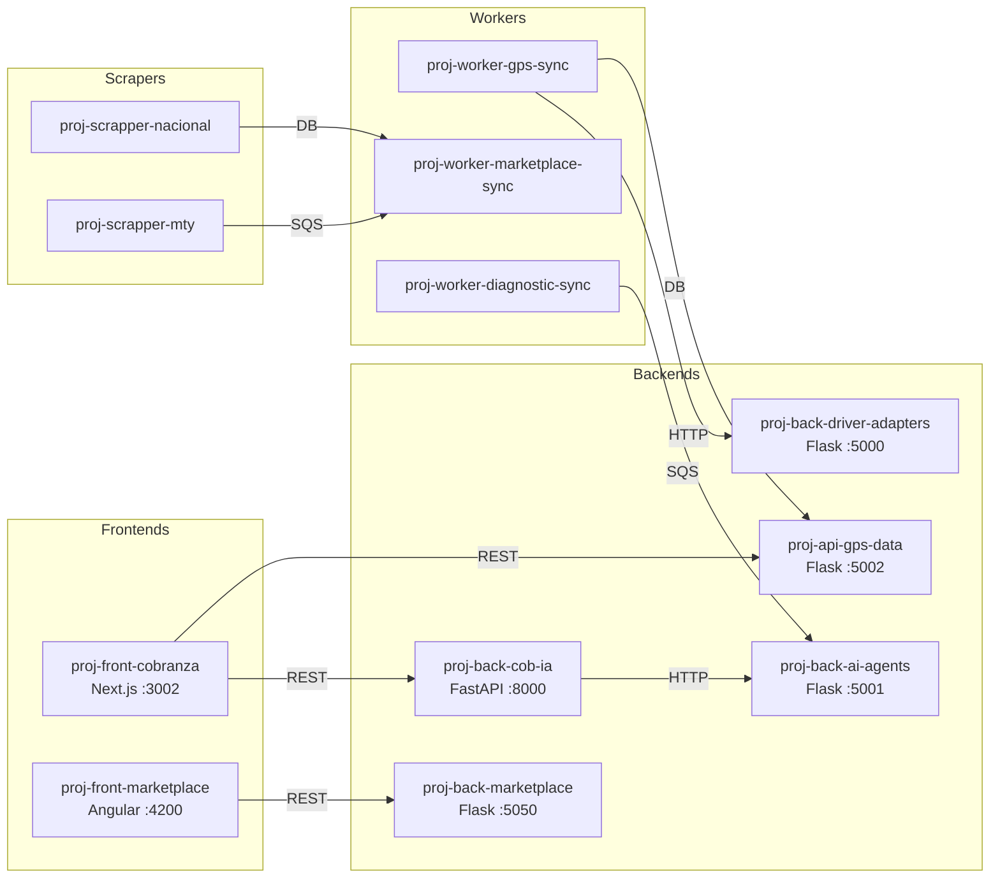

# Catálogo de Repositorios

Los 17 repositorios que componen el ecosistema AgentsMX, organizados por función.

## Tabla Completa de Repositorios

| # | Repositorio | Puerto | Stack | Propósito | Estado |
|---|------------|--------|-------|-----------|--------|
| 1 | `proj-back-cob-ia` | 8000 | FastAPI, scikit-learn, Redis | API principal de cobranza, ML pipeline, predicciones | Producción |
| 2 | `proj-back-ai-agents` | 5001 | Flask, OpenAI, Claude | 7 agentes IA especializados | Producción |
| 3 | `proj-back-driver-adapters` | 5000 | Flask | Adaptadores multi-fuente GPS | Producción |
| 4 | `proj-api-gps-data` | 5002 | Flask, TimescaleDB | API de datos GPS, 25+ endpoints | Producción |
| 5 | `proj-back-marketplace-dashboard` | 5050 | Flask, Claude | Analytics marketplace, chat IA | Desarrollo |
| 6 | `proj-front-cobranza` | 3002 | Next.js 14, PWA | App de cobranza para campo | Producción |
| 7 | `proj-front-marketplace-dashboard` | 4200 | Angular 17 | Dashboard de analytics | Desarrollo |
| 8 | `proj-worker-gps-sync` | - | APScheduler, ThreadPool | Sincronización GPS cada 60s | Producción |
| 9 | `proj-worker-marketplace-sync` | - | SQS Consumer | Sincronización de listings | Desarrollo |
| 10 | `proj-worker-diagnostic-sync` | - | SQS Consumer | Procesamiento diagnósticos OBD-II | Desarrollo |
| 11 | `proj-scrapper-nacional` | - | Scrapy, Playwright | 18 spiders nacionales | Producción |
| 12 | `proj-scrapper-mty` | - | Scrapy, DynamoDB | 17 spiders MTY + AWS | Producción |
| 13 | `proj-infra-terraform` | - | Terraform, AWS | Infraestructura como código | Producción |
| 14 | `proj-infra-mac-mini` | - | Ansible, Docker | Config servidor local | Producción |
| 15 | `proj-infra-grafana` | 3000 | Grafana 11.5, Docker | Monitoreo y dashboards | Producción |
| 16 | `gps-platform-docs` | 5173 | VitePress | Documentación técnica | Producción |
| 17 | `doc-agentsmx` | - | Markdown | Documentación de negocio | Activo |

## Diagrama de Dependencias



## Organización por Dominio

```mermaid
graph TB
    subgraph Cobranza
        direction TB
        C1[proj-back-cob-ia]
        C2[proj-front-cobranza]
        C3[proj-back-ai-agents]
    end

    subgraph GPS
        direction TB
        G1[proj-back-driver-adapters]
        G2[proj-api-gps-data]
        G3[proj-worker-gps-sync]
    end

    subgraph Marketplace
        direction TB
        M1[proj-back-marketplace-dashboard]
        M2[proj-front-marketplace-dashboard]
        M3[proj-worker-marketplace-sync]
        M4[proj-scrapper-nacional]
        M5[proj-scrapper-mty]
    end

    subgraph Diagnósticos
        direction TB
        D1[proj-worker-diagnostic-sync]
    end

    subgraph Infraestructura
        direction TB
        I1[proj-infra-terraform]
        I2[proj-infra-mac-mini]
        I3[proj-infra-grafana]
    end

    subgraph Documentación
        direction TB
        DOC1[gps-platform-docs]
        DOC2[doc-agentsmx]
    end
```



## Convenciones de Nomenclatura

| Prefijo | Significado | Ejemplo |
|---------|-------------|---------|
| `proj-back-` | Servicio backend | `proj-back-cob-ia` |
| `proj-front-` | Aplicación frontend | `proj-front-cobranza` |
| `proj-api-` | API de datos pura | `proj-api-gps-data` |
| `proj-worker-` | Worker asincrónico | `proj-worker-gps-sync` |
| `proj-scrapper-` | Scraper de datos | `proj-scrapper-nacional` |
| `proj-infra-` | Infraestructura | `proj-infra-terraform` |

## Puertos Reservados

```
:3000  - Grafana
:3002  - Cobranza Frontend (Next.js)
:4200  - Dashboard Frontend (Angular)
:5000  - Driver Adapters (Flask)
:5001  - AI Agents (Flask)
:5002  - GPS Data API (Flask)
:5050  - Marketplace API (Flask)
:5173  - Documentación VitePress
:5432  - PostgreSQL (cobranza_db)
:5433  - PostgreSQL (scrapper_nacional)
:6379  - Redis
:8000  - Cobranza IA API (FastAPI)
```
