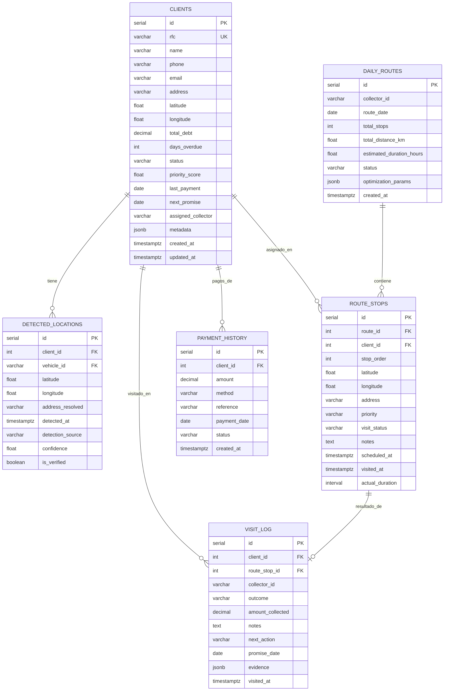
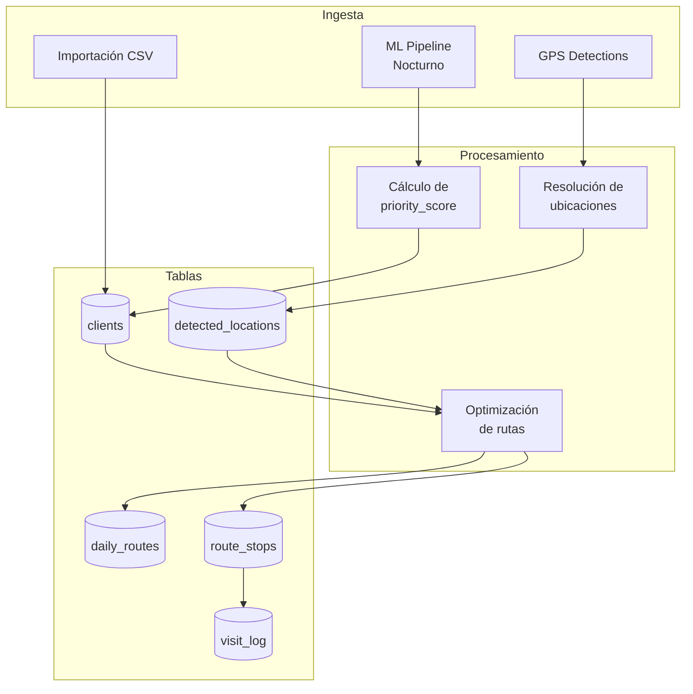

# Base de Datos de Cobranza

Esquema principal de cobranza dentro de `cobranza_db` (PostgreSQL :5432).

## Diagrama ER



## Tabla: clients

Almacena los 794 clientes morosos activos del portafolio de cobranza.

```sql
CREATE TABLE clients (
    id              SERIAL PRIMARY KEY,
    rfc             VARCHAR(13) UNIQUE,
    name            VARCHAR(200) NOT NULL,
    phone           VARCHAR(20),
    email           VARCHAR(100),
    address         TEXT,
    latitude        DOUBLE PRECISION,
    longitude       DOUBLE PRECISION,
    total_debt      DECIMAL(12, 2) NOT NULL DEFAULT 0,
    days_overdue    INTEGER DEFAULT 0,
    status          VARCHAR(20) DEFAULT 'active',
    priority_score  FLOAT DEFAULT 0,
    last_payment    DATE,
    next_promise    DATE,
    assigned_collector VARCHAR(50),
    metadata        JSONB DEFAULT '{}',
    created_at      TIMESTAMPTZ DEFAULT NOW(),
    updated_at      TIMESTAMPTZ DEFAULT NOW()
);

CREATE INDEX idx_clients_priority ON clients (priority_score DESC);
CREATE INDEX idx_clients_status ON clients (status);
CREATE INDEX idx_clients_collector ON clients (assigned_collector);
CREATE INDEX idx_clients_location ON clients (latitude, longitude);
```

## Tabla: detected_locations

Ubicaciones detectadas por GPS donde se ha visto el vehículo del deudor.

```sql
CREATE TABLE detected_locations (
    id               SERIAL PRIMARY KEY,
    client_id        INTEGER REFERENCES clients(id),
    vehicle_id       VARCHAR(50),
    latitude         DOUBLE PRECISION NOT NULL,
    longitude        DOUBLE PRECISION NOT NULL,
    address_resolved TEXT,
    detected_at      TIMESTAMPTZ NOT NULL,
    detection_source VARCHAR(20), -- 'gps', 'manual', 'ai'
    confidence       FLOAT DEFAULT 1.0,
    is_verified      BOOLEAN DEFAULT FALSE
);

CREATE INDEX idx_detected_loc_client ON detected_locations (client_id);
CREATE INDEX idx_detected_loc_time ON detected_locations (detected_at DESC);
```

## Tabla: daily_routes

Rutas optimizadas generadas diariamente para cada cobrador.

```sql
CREATE TABLE daily_routes (
    id                      SERIAL PRIMARY KEY,
    collector_id            VARCHAR(50) NOT NULL,
    route_date              DATE NOT NULL,
    total_stops             INTEGER DEFAULT 0,
    total_distance_km       FLOAT,
    estimated_duration_hours FLOAT,
    status                  VARCHAR(20) DEFAULT 'pending',
    optimization_params     JSONB DEFAULT '{}',
    created_at              TIMESTAMPTZ DEFAULT NOW(),
    UNIQUE(collector_id, route_date)
);
```

## Flujo de Datos



## Estadísticas del Portafolio

| Métrica | Valor |
|---------|-------|
| Clientes activos | 794 |
| Deuda total portafolio | ~$45M MXN |
| Deuda promedio | ~$56,700 MXN |
| Días mora promedio | 127 |
| Ubicaciones detectadas | ~15,000 |
| Rutas generadas/día | ~30 |
| Paradas promedio/ruta | ~12 |

## Queries Frecuentes

```sql
-- Top 20 clientes por prioridad
SELECT id, name, total_debt, days_overdue, priority_score
FROM clients
WHERE status = 'active'
ORDER BY priority_score DESC
LIMIT 20;

-- Ubicaciones frecuentes de un cliente
SELECT latitude, longitude, address_resolved,
       COUNT(*) as visit_count,
       MAX(detected_at) as last_seen
FROM detected_locations
WHERE client_id = $1
GROUP BY latitude, longitude, address_resolved
ORDER BY visit_count DESC;

-- Efectividad de cobranza por cobrador
SELECT collector_id,
       COUNT(*) as total_visits,
       SUM(CASE WHEN outcome = 'payment' THEN 1 ELSE 0 END) as payments,
       SUM(amount_collected) as total_collected
FROM visit_log
WHERE visited_at >= CURRENT_DATE - INTERVAL '30 days'
GROUP BY collector_id;
```
