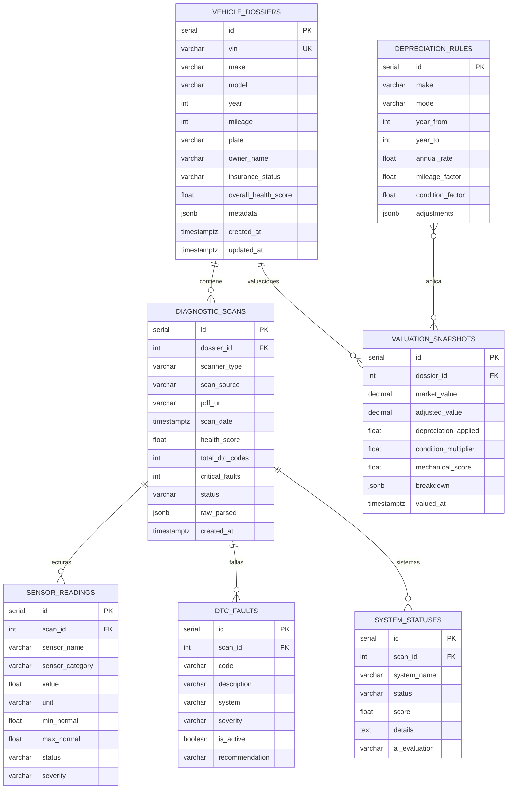
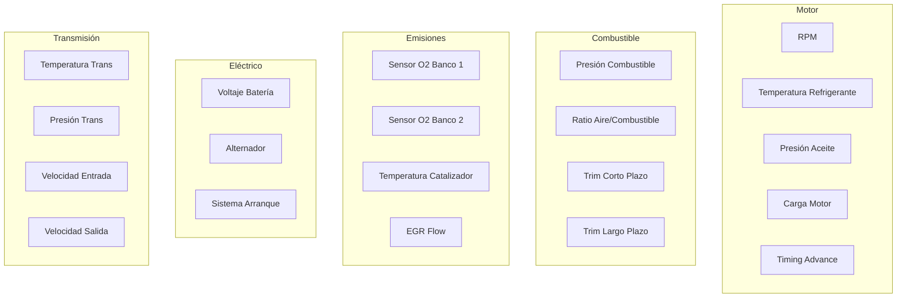
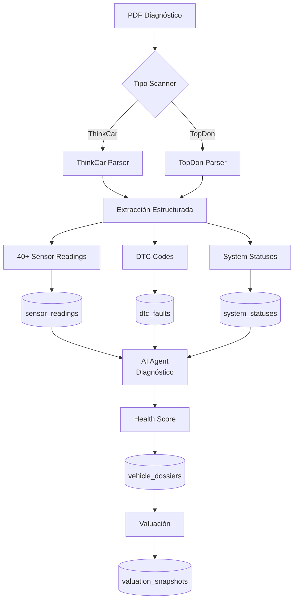

# Base de Datos de Diagnósticos

Esquema para dossiers vehiculares, diagnósticos OBD-II y valuaciones dentro de `cobranza_db` (:5432).

## Diagrama ER



## Tabla: vehicle_dossiers

Expediente maestro de cada vehículo diagnosticado.

```sql
CREATE TABLE vehicle_dossiers (
    id                  SERIAL PRIMARY KEY,
    vin                 VARCHAR(17) UNIQUE,
    make                VARCHAR(50),
    model               VARCHAR(100),
    year                INTEGER,
    mileage             INTEGER,
    plate               VARCHAR(15),
    owner_name          VARCHAR(200),
    insurance_status    VARCHAR(20),
    overall_health_score FLOAT,
    metadata            JSONB DEFAULT '{}',
    created_at          TIMESTAMPTZ DEFAULT NOW(),
    updated_at          TIMESTAMPTZ DEFAULT NOW()
);
```

## Tabla: diagnostic_scans

Cada escaneo OBD-II procesado desde PDF.

```sql
CREATE TABLE diagnostic_scans (
    id              SERIAL PRIMARY KEY,
    dossier_id      INTEGER REFERENCES vehicle_dossiers(id),
    scanner_type    VARCHAR(20) NOT NULL, -- 'thinkcar', 'topdon'
    scan_source     VARCHAR(20),         -- 'email', 'upload', 'sqs'
    pdf_url         TEXT,
    scan_date       TIMESTAMPTZ,
    health_score    FLOAT,
    total_dtc_codes INTEGER DEFAULT 0,
    critical_faults INTEGER DEFAULT 0,
    status          VARCHAR(20) DEFAULT 'processed',
    raw_parsed      JSONB,
    created_at      TIMESTAMPTZ DEFAULT NOW()
);
```

## Tabla: sensor_readings

Las 40+ lecturas de sensores extraídas de cada escaneo.

```sql
CREATE TABLE sensor_readings (
    id               SERIAL PRIMARY KEY,
    scan_id          INTEGER REFERENCES diagnostic_scans(id),
    sensor_name      VARCHAR(100) NOT NULL,
    sensor_category  VARCHAR(50),
    value            DOUBLE PRECISION,
    unit             VARCHAR(20),
    min_normal       DOUBLE PRECISION,
    max_normal       DOUBLE PRECISION,
    status           VARCHAR(20), -- 'normal', 'warning', 'critical'
    severity         VARCHAR(20)
);
```

### Categorías de Sensores



## Tabla: dtc_faults

Códigos de falla diagnóstica (DTC - Diagnostic Trouble Codes).

```sql
CREATE TABLE dtc_faults (
    id              SERIAL PRIMARY KEY,
    scan_id         INTEGER REFERENCES diagnostic_scans(id),
    code            VARCHAR(10) NOT NULL,  -- P0301, B0100, etc.
    description     TEXT,
    system          VARCHAR(50),
    severity        VARCHAR(20),           -- 'info', 'warning', 'critical'
    is_active       BOOLEAN DEFAULT TRUE,
    recommendation  TEXT
);
```

### Clasificación de Códigos DTC

| Prefijo | Sistema | Ejemplo |
|---------|---------|---------|
| P0xxx | Tren motriz genérico | P0301 - Misfire cilindro 1 |
| P1xxx | Tren motriz fabricante | P1234 - Específico OEM |
| B0xxx | Carrocería genérico | B0100 - Airbag malfunction |
| C0xxx | Chasis genérico | C0035 - ABS sensor fault |
| U0xxx | Red/comunicación | U0100 - Lost ECM comm |

## Flujo de Procesamiento



## Tabla: depreciation_rules

Reglas de depreciación por marca, modelo y año.

```sql
CREATE TABLE depreciation_rules (
    id               SERIAL PRIMARY KEY,
    make             VARCHAR(50),
    model            VARCHAR(100),
    year_from        INTEGER,
    year_to          INTEGER,
    annual_rate      FLOAT NOT NULL,      -- 0.15 = 15% anual
    mileage_factor   FLOAT DEFAULT 1.0,   -- Factor por km
    condition_factor FLOAT DEFAULT 1.0,   -- Factor por condición
    adjustments      JSONB DEFAULT '{}'
);
```

## Tabla: valuation_snapshots

Valuaciones calculadas combinando mercado + diagnóstico + depreciación.

```sql
CREATE TABLE valuation_snapshots (
    id                   SERIAL PRIMARY KEY,
    dossier_id           INTEGER REFERENCES vehicle_dossiers(id),
    market_value         DECIMAL(12, 2),
    adjusted_value       DECIMAL(12, 2),
    depreciation_applied FLOAT,
    condition_multiplier FLOAT,
    mechanical_score     FLOAT,
    breakdown            JSONB,
    valued_at            TIMESTAMPTZ DEFAULT NOW()
);
```
