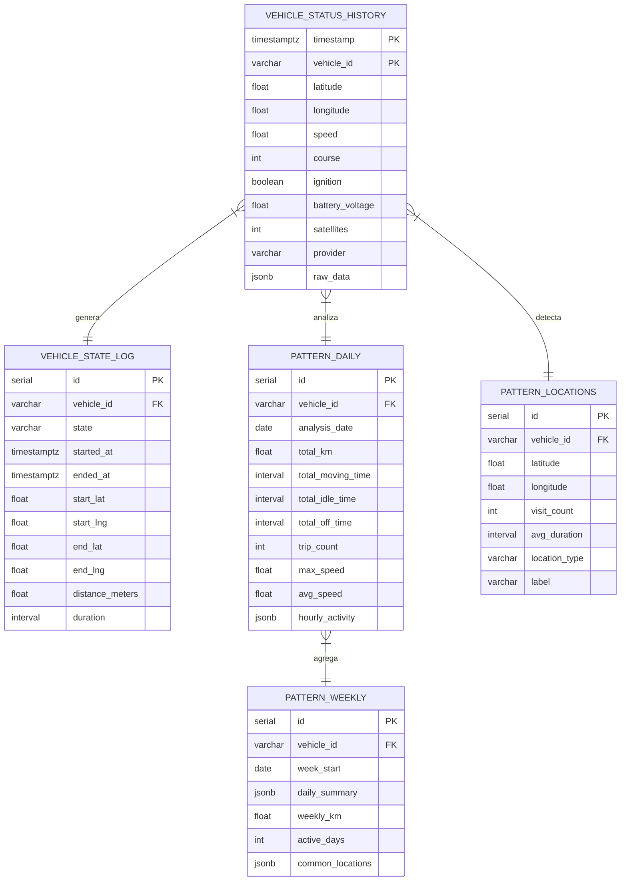
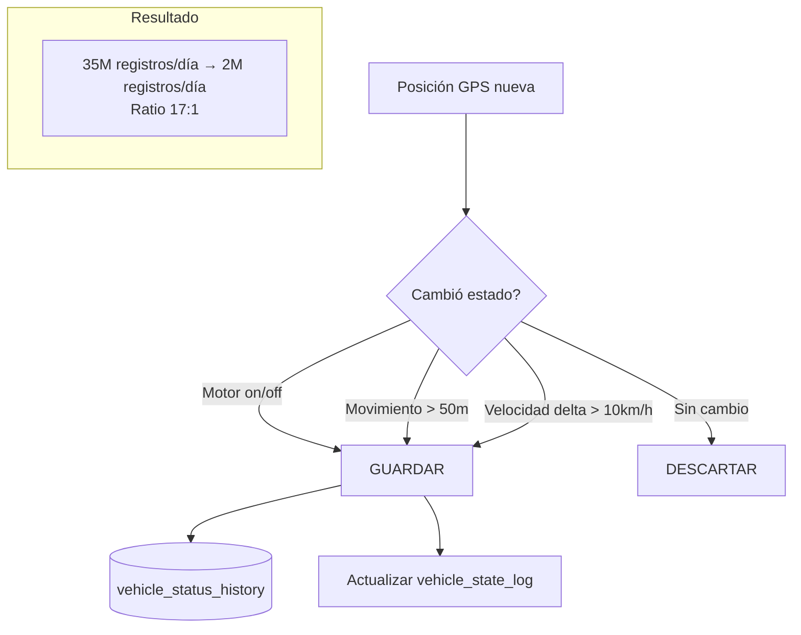

# GPS Data - TimescaleDB

Esquema de TimescaleDB para almacenamiento de series temporales GPS con compresión diferencial.

## Extensión TimescaleDB

TimescaleDB extiende PostgreSQL para manejar eficientemente series temporales. Se ejecuta como extensión dentro de `cobranza_db` (:5432).

```sql
CREATE EXTENSION IF NOT EXISTS timescaledb;
```

## Esquema de Tablas



## Hypertable Principal

```sql
-- Tabla principal de posiciones GPS
CREATE TABLE vehicle_status_history (
    timestamp     TIMESTAMPTZ NOT NULL,
    vehicle_id    VARCHAR(50) NOT NULL,
    latitude      DOUBLE PRECISION,
    longitude     DOUBLE PRECISION,
    speed         DOUBLE PRECISION DEFAULT 0,
    course        INTEGER DEFAULT 0,
    ignition      BOOLEAN DEFAULT FALSE,
    battery_voltage DOUBLE PRECISION,
    satellites    INTEGER,
    provider      VARCHAR(20),
    raw_data      JSONB,
    PRIMARY KEY (timestamp, vehicle_id)
);

-- Convertir a hypertable con chunks de 7 días
SELECT create_hypertable(
    'vehicle_status_history',
    'timestamp',
    chunk_time_interval => INTERVAL '7 days'
);

-- Política de compresión automática después de 30 días
ALTER TABLE vehicle_status_history SET (
    timescaledb.compress,
    timescaledb.compress_segmentby = 'vehicle_id',
    timescaledb.compress_orderby = 'timestamp DESC'
);

SELECT add_compression_policy(
    'vehicle_status_history',
    INTERVAL '30 days'
);

-- Política de retención: eliminar datos mayores a 1 año
SELECT add_retention_policy(
    'vehicle_status_history',
    INTERVAL '1 year'
);
```

## Compresión Diferencial

El GPS Sync Worker implementa compresión diferencial: solo almacena registros cuando hay un cambio de estado significativo.



## Trigger Diferencial

```sql
-- Trigger que decide si almacenar el registro
CREATE OR REPLACE FUNCTION check_state_change()
RETURNS TRIGGER AS $$
DECLARE
    last_record RECORD;
BEGIN
    SELECT * INTO last_record
    FROM vehicle_status_history
    WHERE vehicle_id = NEW.vehicle_id
    ORDER BY timestamp DESC LIMIT 1;

    IF last_record IS NULL THEN
        RETURN NEW;  -- Primer registro
    END IF;

    -- Cambio de ignición
    IF last_record.ignition != NEW.ignition THEN
        RETURN NEW;
    END IF;

    -- Movimiento significativo (>50 metros)
    IF haversine_meters(
        last_record.latitude, last_record.longitude,
        NEW.latitude, NEW.longitude
    ) > 50 THEN
        RETURN NEW;
    END IF;

    -- Sin cambio significativo, descartar
    RETURN NULL;
END;
$$ LANGUAGE plpgsql;
```

## Función Haversine

```sql
CREATE OR REPLACE FUNCTION haversine_meters(
    lat1 DOUBLE PRECISION, lon1 DOUBLE PRECISION,
    lat2 DOUBLE PRECISION, lon2 DOUBLE PRECISION
) RETURNS DOUBLE PRECISION AS $$
SELECT 6371000.0 * 2.0 * asin(sqrt(
    power(sin(radians(lat2 - lat1) / 2.0), 2) +
    cos(radians(lat1)) * cos(radians(lat2)) *
    power(sin(radians(lon2 - lon1) / 2.0), 2)
))
$$ LANGUAGE sql IMMUTABLE STRICT;
```

## Índices

```sql
-- Índice principal por vehículo y tiempo
CREATE INDEX idx_vsh_vehicle_time
    ON vehicle_status_history (vehicle_id, timestamp DESC);

-- Índice para consultas de estado del motor
CREATE INDEX idx_vsh_ignition
    ON vehicle_status_history (ignition, timestamp DESC)
    WHERE ignition = true;

-- Índice espacial para queries geográficos
CREATE INDEX idx_vsh_location
    ON vehicle_status_history (latitude, longitude);
```

## Vistas Materializadas

```sql
-- Resumen diario por vehículo
CREATE MATERIALIZED VIEW mv_daily_vehicle_summary AS
SELECT
    time_bucket('1 day', timestamp) AS day,
    vehicle_id,
    count(*) AS total_records,
    sum(CASE WHEN speed > 0 THEN 1 ELSE 0 END) AS moving_records,
    max(speed) AS max_speed,
    avg(speed) FILTER (WHERE speed > 0) AS avg_speed
FROM vehicle_status_history
GROUP BY day, vehicle_id
WITH DATA;

-- Refresh automático cada hora
SELECT add_continuous_aggregate_policy('mv_daily_vehicle_summary',
    start_offset => INTERVAL '3 days',
    end_offset => INTERVAL '1 hour',
    schedule_interval => INTERVAL '1 hour'
);
```

## Métricas de Almacenamiento

| Métrica | Valor |
|---------|-------|
| Registros/día (comprimidos) | ~2,000,000 |
| Tamaño chunk (7 días) | ~800 MB |
| Tamaño comprimido (30+ días) | ~200 MB/chunk |
| Ratio compresión TimescaleDB | ~4:1 |
| Ratio total (diferencial + TimescaleDB) | ~68:1 |
| Tamaño anual estimado | ~50 GB |
