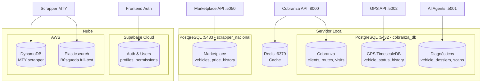
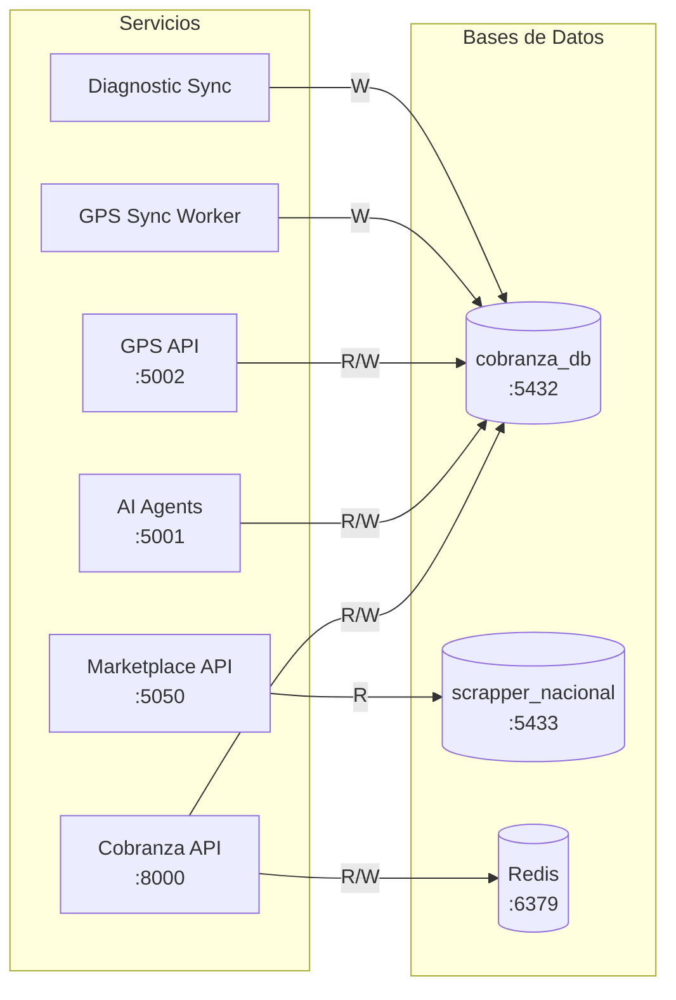

# Bases de Datos

Panorama de las 3 bases de datos principales del ecosistema AgentsMX.

## Resumen

| Base de Datos | Host | Puerto | Motor | Tamaño | Propósito |
|---------------|------|--------|-------|--------|-----------|
| cobranza_db | localhost | 5432 | PostgreSQL 16 + TimescaleDB | ~60 GB | Cobranza, GPS, diagnósticos |
| scrapper_nacional | localhost | 5433 | PostgreSQL 16 | ~5 GB | Vehículos marketplace |
| Supabase | cloud | 5432 | PostgreSQL 15 (managed) | ~2 GB | Auth, usuarios, configs |

## Diagrama General



## Diagrama Entidad-Relación Global

```mermaid
erDiagram
    CLIENTS ||--o{ DETECTED_LOCATIONS : tiene
    CLIENTS ||--o{ DAILY_ROUTES : asignado_en
    CLIENTS ||--o{ ROUTE_STOPS : parada_de
    DAILY_ROUTES ||--o{ ROUTE_STOPS : contiene

    VEHICLE_STATUS_HISTORY }|--|| VEHICLES_GPS : pertenece
    VEHICLE_STATE_LOG }|--|| VEHICLES_GPS : estado_de
    PATTERN_ANALYSIS }|--|| VEHICLES_GPS : patron_de

    VEHICLE_DOSSIERS ||--o{ DIAGNOSTIC_SCANS : tiene
    DIAGNOSTIC_SCANS ||--o{ SENSOR_READINGS : contiene
    DIAGNOSTIC_SCANS ||--o{ DTC_FAULTS : reporta
    DIAGNOSTIC_SCANS ||--o{ SYSTEM_STATUSES : evalua
    VEHICLE_DOSSIERS ||--o{ VALUATION_SNAPSHOTS : valuacion_de

    VEHICLES_MKT ||--o{ KAVAK_PRICE_HISTORY : historial_de
    VEHICLES_MKT ||--o{ VEHICLE_MEDIA : imagenes
    VEHICLES_MKT ||--o{ PURCHASE_INTENTS : compra_de
    USERS_MKT ||--o{ PURCHASE_INTENTS : realiza
    USERS_MKT ||--o{ CREDIT_APPLICATIONS : solicita
    USERS_MKT ||--o{ INSURANCE_POLICIES : contrata
    USERS_MKT ||--o{ KYC_VERIFICATIONS : verifica
    CREDIT_APPLICATIONS ||--o{ LENDER_OFFERS : recibe
    INSURANCE_QUOTES ||--o{ INSURANCE_OFFERS : cotiza
```



## Conexiones por Servicio



## Migraciones

Todas las bases de datos utilizan **Alembic** para gestión de migraciones.

```bash
# Crear nueva migración
alembic revision --autogenerate -m "add_new_table"

# Aplicar migraciones
alembic upgrade head

# Revertir última migración
alembic downgrade -1

# Ver historial
alembic history
```

## Backups

| Base de Datos | Estrategia | Frecuencia | Retención |
|---------------|-----------|------------|-----------|
| cobranza_db | pg_dump + S3 | Diario 3:00 AM | 30 días |
| scrapper_nacional | pg_dump + S3 | Semanal | 14 días |
| Supabase | Automático (managed) | Diario | 7 días |
| Redis | RDB snapshot | Cada 15 min | 24 horas |

## Siguiente Lectura

- [Marketplace Microservices](/tecnico/base-datos/marketplace-microservices) - ER completo: vehicles, auth, purchase, financing, insurance, KYC, chat, reports
- [GPS Data (TimescaleDB)](/tecnico/base-datos/gps-data) - Hypertables y compresión
- [Cobranza](/tecnico/base-datos/cobranza) - Clientes y rutas
- [Scrapper Nacional](/tecnico/base-datos/scrapper-nacional) - Vehículos marketplace
- [Diagnósticos](/tecnico/base-datos/diagnosticos) - Dossiers y sensores
