# Base de Datos - Marketplace Microservices

Esquema de entidades del ecosistema de microservicios del Marketplace AgentsMX. Estos modelos representan el diseño de base de datos objetivo para cada bounded context.

> **Estado actual**: Solo `marketplace.vehicles` tiene tabla SQL (Alembic). El resto son modelos de dominio que serán persistidos conforme se implementen los servicios.

## Diagrama ER Global

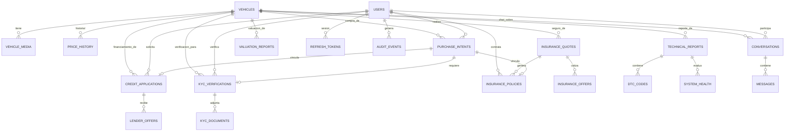

---

## 1. Vehicles (svc-vehicles)

Tabla activa en PostgreSQL :5432, schema `marketplace`.

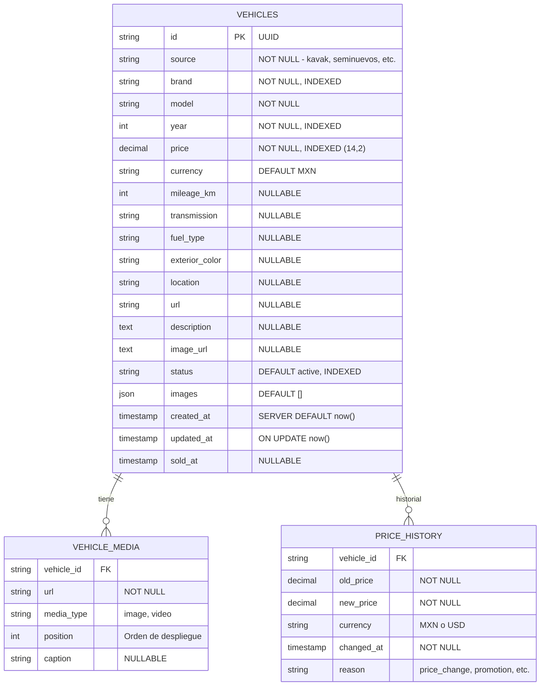

### Indices

| Indice | Columnas | Tipo |
|--------|----------|------|
| `ix_vehicles_brand` | brand | B-tree |
| `ix_vehicles_year` | year | B-tree |
| `ix_vehicles_price` | price | B-tree |
| `ix_vehicles_status` | status | B-tree |
| `ix_vehicles_brand_model` | brand, model | Compuesto |
| `ix_vehicles_source` | source | B-tree |
| `uq_vehicles_source_id` | source, id | UNIQUE |

---

## 2. Auth & Users (svc-auth, svc-users)

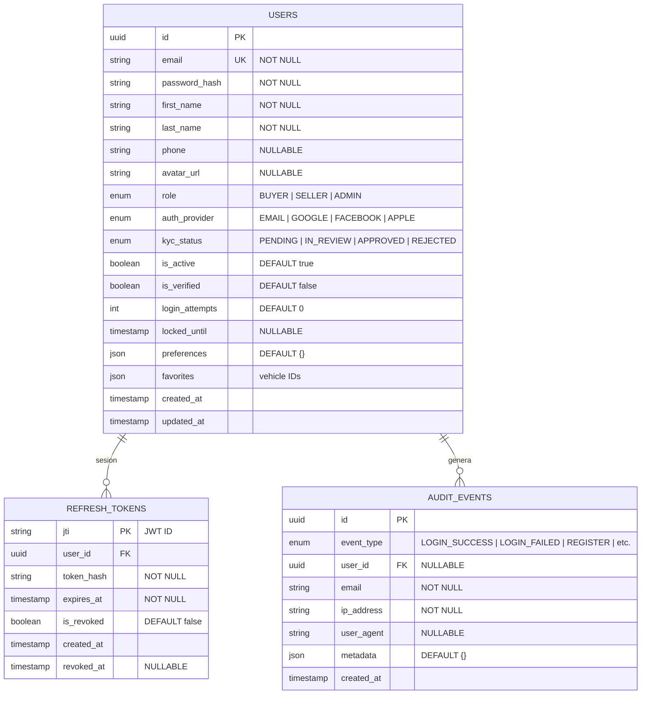

### Enums

| Enum | Valores |
|------|---------|
| `UserRole` | BUYER, SELLER, ADMIN |
| `KYCStatus` | PENDING, IN_REVIEW, APPROVED, REJECTED |
| `AuthProvider` | EMAIL, GOOGLE, FACEBOOK, APPLE |
| `AuditEventType` | LOGIN_SUCCESS, LOGIN_FAILED, REGISTER, PASSWORD_RESET, LOGOUT, TOKEN_REFRESH, ACCOUNT_LOCKED, PASSWORD_CHANGE |

---

## 3. Purchase Flow (svc-purchase)

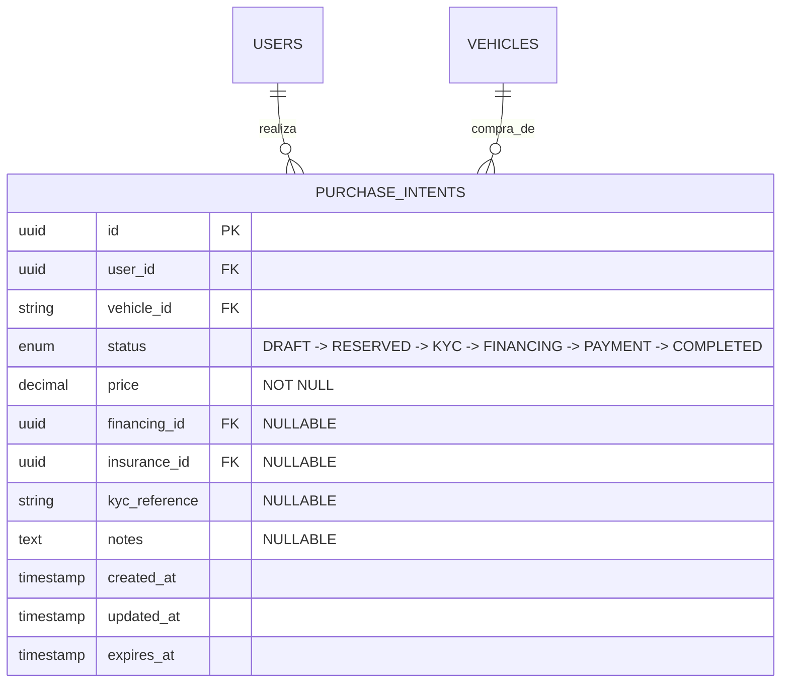

### Flujo de estados

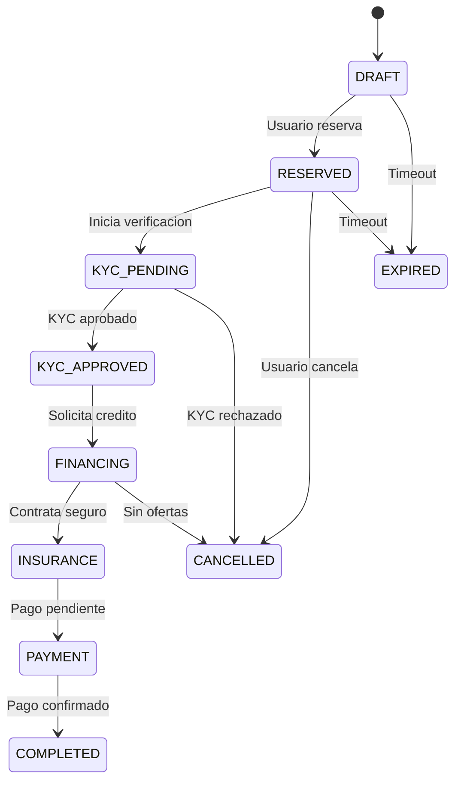

---

## 4. Financing (svc-financing)

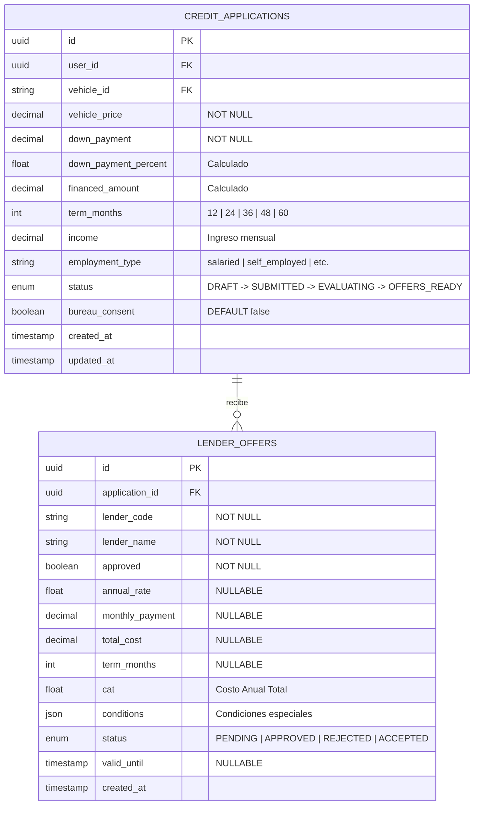

---

## 5. Insurance (svc-insurance)

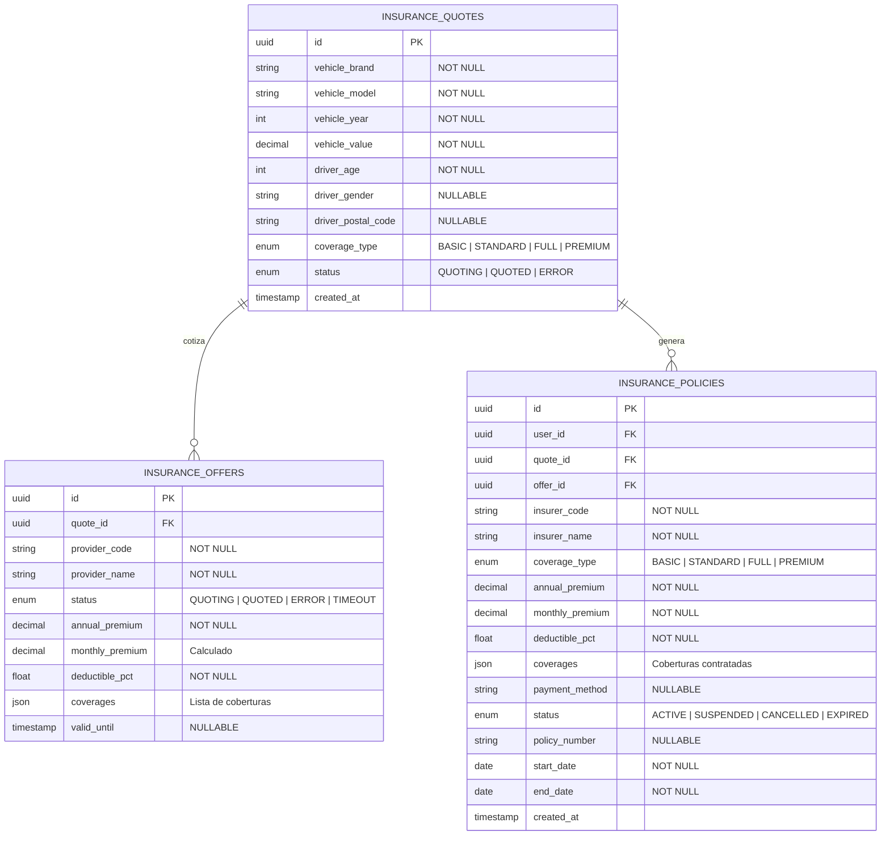

---

## 6. KYC (svc-kyc)

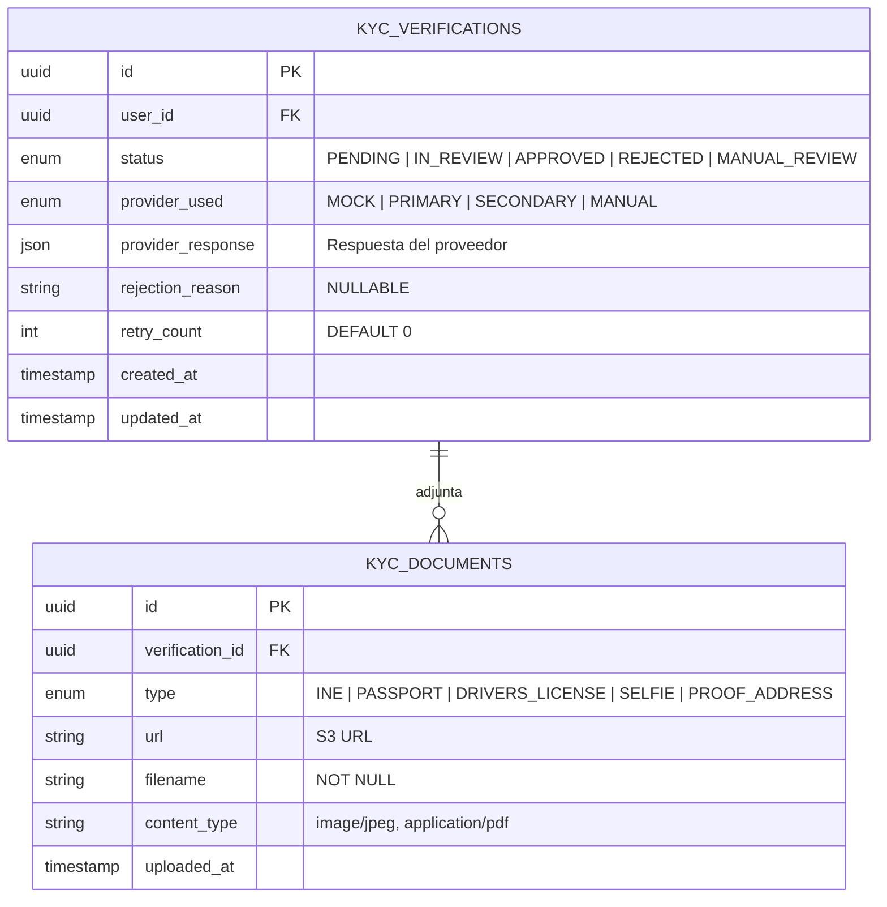

---

## 7. Chat (svc-chat)

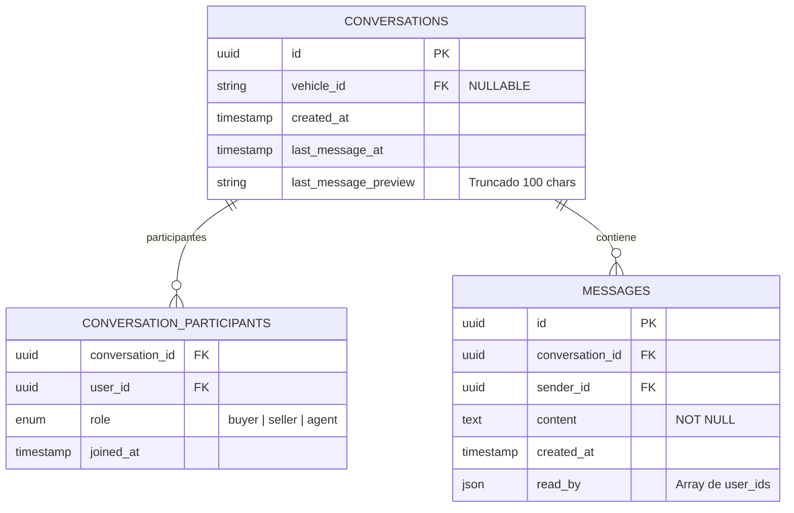

---

## 8. Reports (svc-reports)

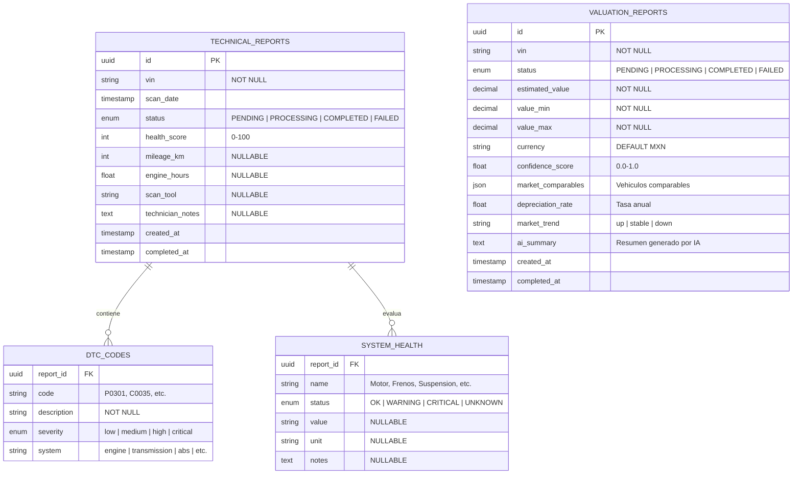

---

## 9. Market Analytics (svc-market-analytics)

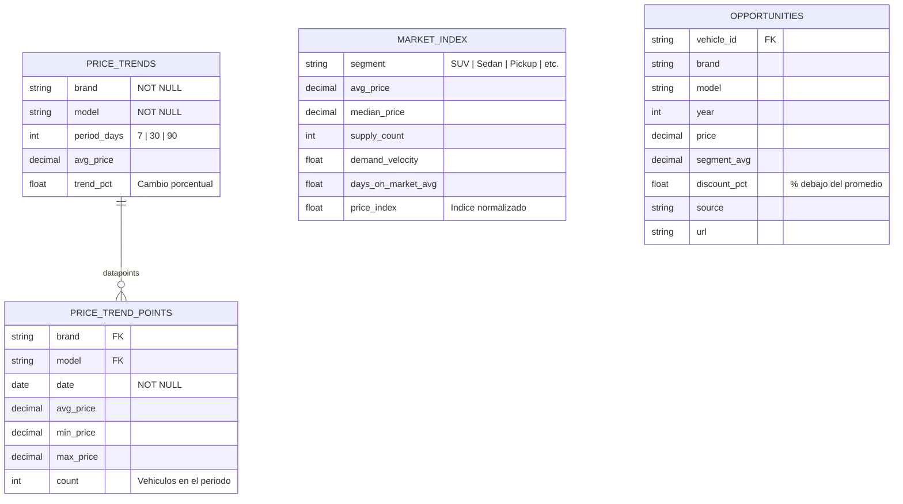

---

## 10. Admin (svc-admin)

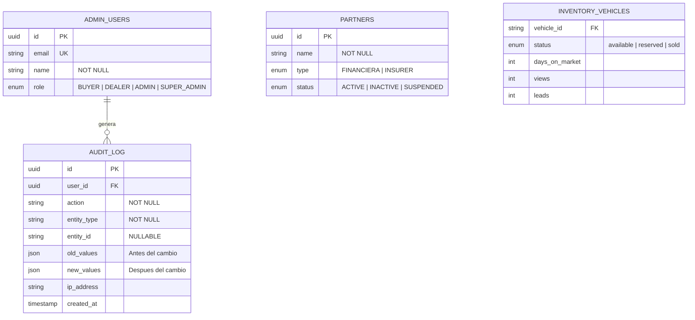

---

## Diagrama de Flujo Completo del Usuario

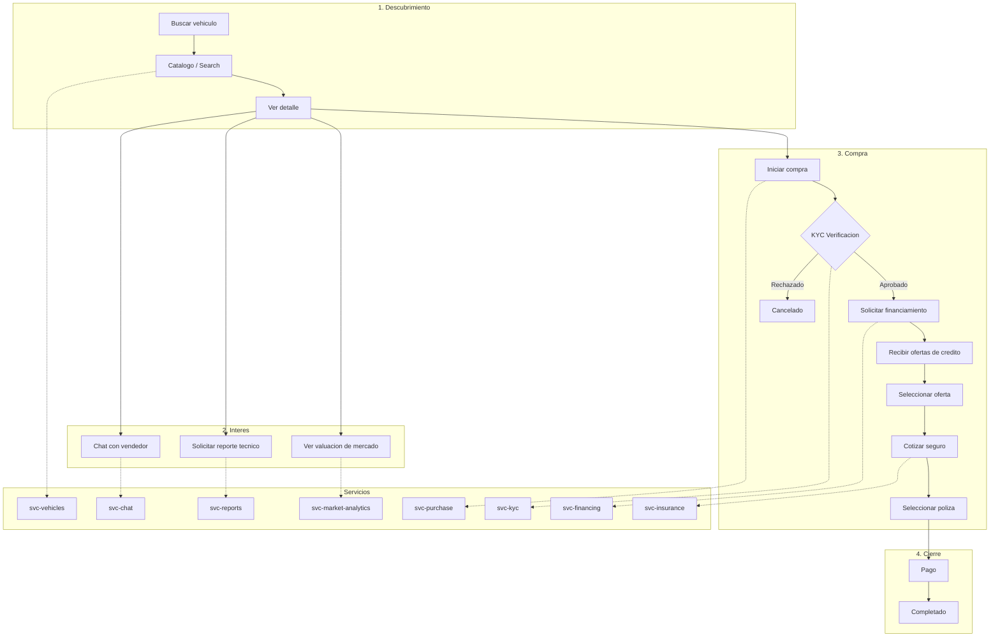

---

## Relacion con BD Existente (scrapper_nacional)

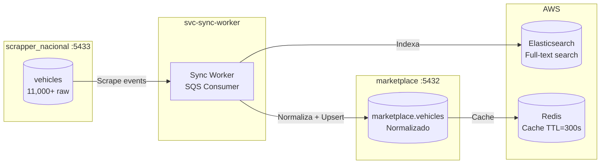

## Siguiente Lectura

- [Scrapper Nacional](/tecnico/base-datos/scrapper-nacional) - BD fuente de vehículos
- [Cobranza](/tecnico/base-datos/cobranza) - Clientes y rutas
- [GPS Data](/tecnico/base-datos/gps-data) - TimescaleDB
- [Diagnósticos](/tecnico/base-datos/diagnosticos) - Dossiers y sensores
