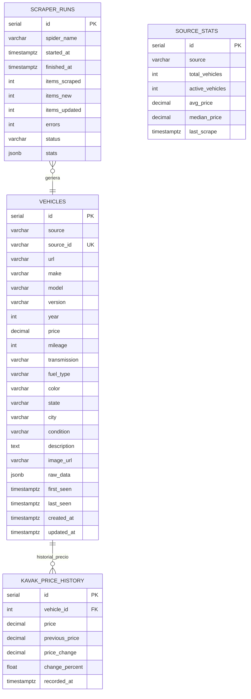
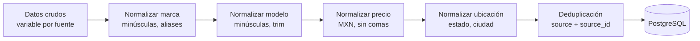

# Base de Datos Scrapper Nacional

Esquema de `scrapper_nacional` (PostgreSQL :5433) para almacenamiento de vehículos del marketplace.

## Diagrama ER



## Tabla: vehicles

Tabla principal con 11,000+ vehículos de 18 fuentes diferentes.

```sql
CREATE TABLE vehicles (
    id              SERIAL PRIMARY KEY,
    source          VARCHAR(50) NOT NULL,
    source_id       VARCHAR(200),
    url             TEXT,
    make            VARCHAR(50),
    model           VARCHAR(100),
    version         VARCHAR(200),
    year            INTEGER,
    price           DECIMAL(12, 2),
    mileage         INTEGER,
    transmission    VARCHAR(20),
    fuel_type       VARCHAR(20),
    color           VARCHAR(30),
    state           VARCHAR(50),
    city            VARCHAR(100),
    condition       VARCHAR(20),
    description     TEXT,
    image_url       TEXT,
    raw_data        JSONB DEFAULT '{}',
    first_seen      TIMESTAMPTZ DEFAULT NOW(),
    last_seen       TIMESTAMPTZ DEFAULT NOW(),
    created_at      TIMESTAMPTZ DEFAULT NOW(),
    updated_at      TIMESTAMPTZ DEFAULT NOW(),
    UNIQUE(source, source_id)
);

-- Índices principales
CREATE INDEX idx_vehicles_source ON vehicles (source);
CREATE INDEX idx_vehicles_make_model ON vehicles (make, model);
CREATE INDEX idx_vehicles_year ON vehicles (year);
CREATE INDEX idx_vehicles_price ON vehicles (price);
CREATE INDEX idx_vehicles_state ON vehicles (state);
CREATE INDEX idx_vehicles_last_seen ON vehicles (last_seen DESC);
CREATE INDEX idx_vehicles_make_model_year ON vehicles (make, model, year);
```

## Los 19 Campos

| Campo | Tipo | Descripción | Ejemplo |
|-------|------|-------------|---------|
| `source` | varchar | Fuente del scraping | "kavak" |
| `source_id` | varchar | ID único en la fuente | "kv-12345" |
| `url` | text | URL original del listado | "https://kavak.com/..." |
| `make` | varchar | Marca normalizada | "volkswagen" |
| `model` | varchar | Modelo normalizado | "jetta" |
| `version` | varchar | Versión/trim | "comfortline 1.4t" |
| `year` | int | Año modelo | 2020 |
| `price` | decimal | Precio en MXN | 385000.00 |
| `mileage` | int | Kilometraje | 45000 |
| `transmission` | varchar | Transmisión | "automatic" |
| `fuel_type` | varchar | Tipo combustible | "gasoline" |
| `color` | varchar | Color | "blanco" |
| `state` | varchar | Estado (ubicación) | "nuevo_leon" |
| `city` | varchar | Ciudad | "monterrey" |
| `condition` | varchar | Condición | "used" |
| `description` | text | Descripción del vendedor | "Excelente estado..." |
| `image_url` | text | URL imagen principal | "https://..." |
| `raw_data` | jsonb | Datos originales completos | {...} |
| `first_seen` | timestamptz | Primera vez detectado | 2024-01-15 |

## Tabla: kavak_price_history

Seguimiento histórico de cambios de precio en Kavak.

```sql
CREATE TABLE kavak_price_history (
    id              SERIAL PRIMARY KEY,
    vehicle_id      INTEGER REFERENCES vehicles(id),
    price           DECIMAL(12, 2) NOT NULL,
    previous_price  DECIMAL(12, 2),
    price_change    DECIMAL(12, 2),
    change_percent  FLOAT,
    recorded_at     TIMESTAMPTZ DEFAULT NOW()
);

CREATE INDEX idx_kph_vehicle ON kavak_price_history (vehicle_id);
CREATE INDEX idx_kph_recorded ON kavak_price_history (recorded_at DESC);
```

## Las 18 Fuentes

```mermaid
graph TB
    subgraph Fuentes API/JSON
        S1[Kavak - ~3,500]
    end

    subgraph Fuentes XML
        S2[Albacar - ~1,200]
    end

    subgraph Fuentes HTML
        S3[CarOne - ~800]
        S4[Seminuevos.com - ~2,000]
        S5[Autocosmos - ~1,500]
        S6[Soloautos - ~600]
        S7[Crautos - ~400]
        S8[ViveAnuncios - ~300]
        S9[SegundaMano - ~250]
        S10[Carvana MX - ~200]
        S11[AutoPlaza - ~180]
        S12[MiCochero - ~150]
    end

    subgraph Fuentes Playwright
        S13[Rada - ~300]
        S14[Motoria - ~250]
        S15[GrupoRio - ~200]
        S16[NovaBuys - ~150]
        S17[AutoStar - ~100]
        S18[CarMax MX - ~80]
    end

    DB[(scrapper_nacional\n11,000+ vehículos)]

    S1 --> DB
    S2 --> DB
    S3 --> DB
    S4 --> DB
    S5 --> DB
    S6 --> DB
    S13 --> DB
    S14 --> DB
```



## Normalización de Datos

El pipeline de Scrapy normaliza todos los datos antes de insertar:



## Queries de Analytics

```sql
-- Precio promedio por marca y modelo
SELECT make, model, year,
       COUNT(*) as listings,
       AVG(price) as avg_price,
       MIN(price) as min_price,
       MAX(price) as max_price
FROM vehicles
WHERE price > 50000 AND price < 2000000
GROUP BY make, model, year
ORDER BY listings DESC;

-- Tendencia de precio Kavak
SELECT date_trunc('week', recorded_at) as week,
       AVG(price) as avg_price,
       AVG(change_percent) as avg_change
FROM kavak_price_history kph
JOIN vehicles v ON v.id = kph.vehicle_id
WHERE v.make = 'volkswagen' AND v.model = 'jetta'
GROUP BY week
ORDER BY week;
```
