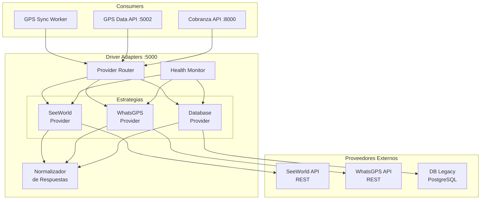
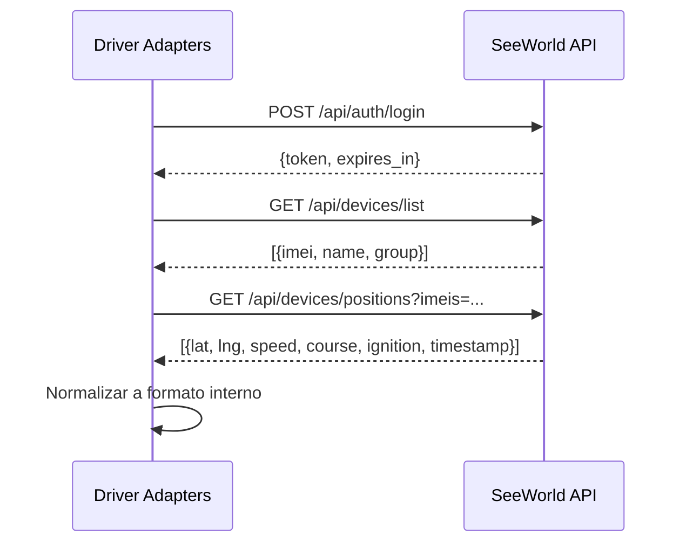
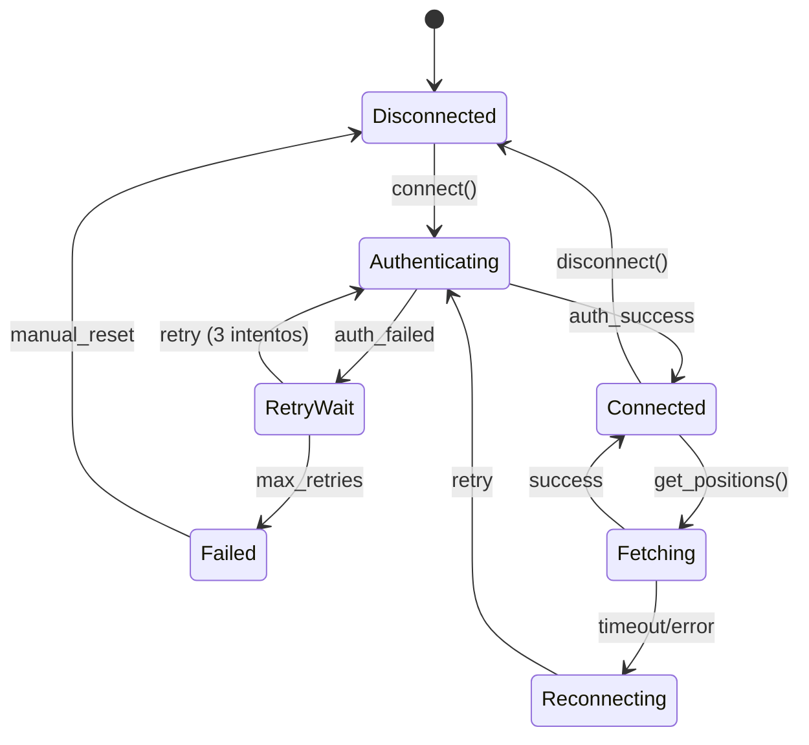
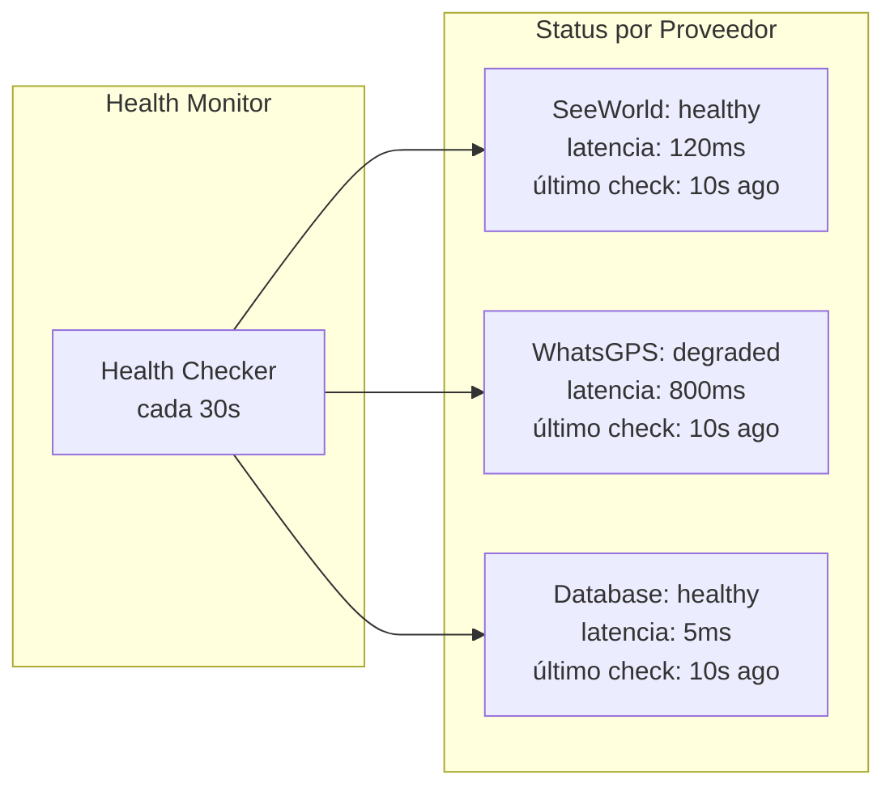

# Driver Adapters Service

`proj-back-driver-adapters` - Adaptador multi-fuente para integración con proveedores GPS.

## Información General

| Propiedad | Valor |
|-----------|-------|
| Repositorio | `proj-back-driver-adapters` |
| Framework | Flask |
| Puerto | 5000 |
| Proveedores | SeeWorld, WhatsGPS, Database |
| Patrón | Strategy + Adapter |

## Arquitectura



## Tipos de Proveedor

### SeeWorld (Principal)

Proveedor GPS principal utilizado por la mayoría de vehículos en la flota.



### WhatsGPS (Secundario)

Proveedor alternativo para dispositivos específicos.

### Database (Legacy)

Acceso directo a base de datos para dispositivos sin API REST.

## Endpoints

| Método | Ruta | Descripción |
|--------|------|-------------|
| GET | `/api/v1/positions` | Posiciones actuales de todos los dispositivos |
| GET | `/api/v1/positions/{imei}` | Posición de un dispositivo específico |
| GET | `/api/v1/devices` | Lista de dispositivos registrados |
| GET | `/api/v1/devices/{imei}/info` | Información detallada del dispositivo |
| GET | `/api/v1/providers/status` | Estado de conexión por proveedor |
| POST | `/api/v1/providers/refresh` | Forzar reconexión a proveedores |
| GET | `/health` | Health check del servicio |

## Modelo de Datos Normalizado

Todos los proveedores normalizan su respuesta al siguiente formato:

```python
@dataclass
class NormalizedPosition:
    imei: str              # Identificador único del dispositivo
    latitude: float        # Latitud decimal
    longitude: float       # Longitud decimal
    speed: float           # Velocidad en km/h
    course: int            # Dirección en grados (0-360)
    ignition: bool         # Estado del motor
    timestamp: datetime    # Marca temporal UTC
    provider: str          # "seeworld" | "whatsgps" | "database"
    raw_data: dict         # Datos originales sin procesar
```

## Flujo de Conexión



## Health Checks

El servicio monitorea la salud de cada proveedor de forma independiente.



## Configuración Multi-Tenant

El servicio soporta múltiples cuentas GPS, útil para gestionar flotas de diferentes clientes.

```python
# config/providers.yaml
providers:
  seeworld:
    accounts:
      - name: "Flota Principal"
        api_url: "https://api.seeworld.com/v1"
        username: "${SEEWORLD_USER_1}"
        password: "${SEEWORLD_PASS_1}"
        device_count: 3200
      - name: "Flota Secundaria"
        api_url: "https://api.seeworld.com/v1"
        username: "${SEEWORLD_USER_2}"
        password: "${SEEWORLD_PASS_2}"
        device_count: 800
  whatsgps:
    accounts:
      - name: "WhatsGPS Default"
        api_url: "https://api.whatsgps.com"
        token: "${WHATSGPS_TOKEN}"
```

## Variables de Entorno

```bash
FLASK_PORT=5000
SEEWORLD_API_URL=https://api.seeworld.com/v1
SEEWORLD_USER=user
SEEWORLD_PASS=pass
WHATSGPS_API_URL=https://api.whatsgps.com
WHATSGPS_TOKEN=token
HEALTH_CHECK_INTERVAL=30
CONNECTION_TIMEOUT=10
MAX_RETRIES=3
```
