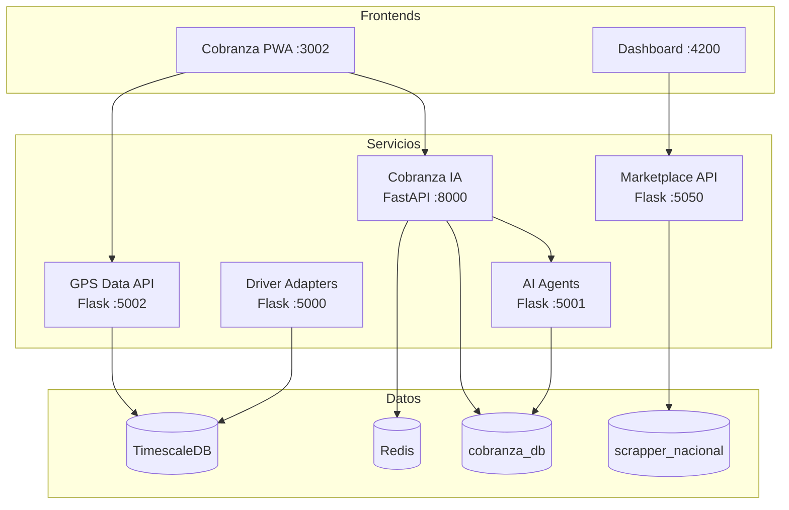
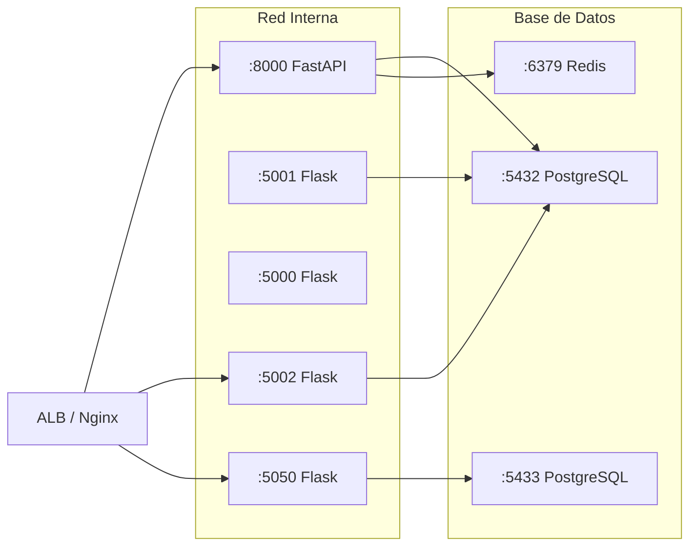
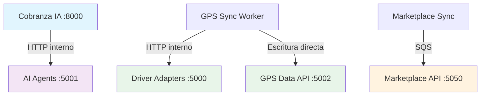

# Servicios Backend

Resumen de los 5 servicios backend que forman el núcleo del ecosistema AgentsMX.

## Tabla de Servicios

| Servicio | Puerto | Framework | Endpoints | Base de Datos | Características Clave |
|----------|--------|-----------|-----------|---------------|----------------------|
| [Cobranza IA](/tecnico/servicios/cob-ia) | 8000 | FastAPI | ~30 | cobranza_db + Redis | ML Pipeline, predicciones, rutas |
| [AI Agents](/tecnico/servicios/ai-agents) | 5001 | Flask | ~15 | cobranza_db | 7 agentes IA, hexagonal |
| [Driver Adapters](/tecnico/servicios/driver-adapters) | 5000 | Flask | ~10 | - | Multi-GPS, SeeWorld/WhatsGPS |
| [GPS Data API](/tecnico/servicios/gps-api) | 5002 | Flask | 25+ | TimescaleDB | Series temporales, patrones |
| [Marketplace API](/tecnico/servicios/marketplace-api) | 5050 | Flask | ~20 | scrapper_nacional | Analytics, chat con Claude |

## Diagrama de Interacción



## Configuración de Red



## Patrones Comunes

Todos los servicios comparten estas prácticas:

- **Health Check**: Endpoint `GET /health` en cada servicio
- **CORS**: Configurado para dominios `*.agentsmx.com`
- **Error Handling**: Manejo centralizado de excepciones con códigos HTTP estándar
- **Logging**: Formato estructurado JSON con nivel configurable
- **Environment**: Variables de entorno para configuración (no hardcoded)

## Stack Tecnológico Común

| Componente | Tecnología | Versión |
|------------|-----------|---------|
| Runtime | Python | 3.11+ |
| ORM | SQLAlchemy | 2.0 |
| Migrations | Alembic | 1.12 |
| Serialización | Pydantic (FastAPI) / Marshmallow (Flask) | v2 / v3 |
| Testing | pytest | 7.4 |
| Linting | ruff | 0.1+ |
| Type Checking | mypy | 1.7 |
| Containerización | Docker | Multi-stage builds |

## Dependencias entre Servicios



## Estado de Salud

Cada servicio expone un endpoint de salud que verifica:

1. **Conexión a base de datos**: Ping a PostgreSQL/TimescaleDB
2. **Conexión a cache**: Ping a Redis (donde aplica)
3. **Servicios externos**: Status de APIs de terceros
4. **Uso de memoria**: Métricas del proceso

```python
# Ejemplo de health check estándar
@app.get("/health")
def health_check():
    return {
        "status": "healthy",
        "service": "cob-ia",
        "version": "1.2.0",
        "db": check_db_connection(),
        "redis": check_redis_connection(),
        "uptime": get_uptime()
    }
```
